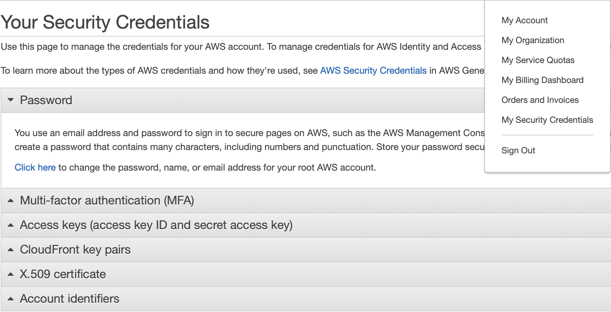

# script-api-lambda-dynamodb

[](https://travis-ci.com/enpuyou/script-api-lambda-dynamodb)

A script for automating deployment of api-lambda-dynamodb

## Instruction

### Make AWS account

After successfully making the account, go to

```
My Security Credentials > Access keys > Create New Access Key
```

This will generate and download a `csv` file containing the
`Access Key ID` and `Secret Access Key`, which later will be put
in the AWS-CLI configure. Save them into environment variables using
`AWS_ACCESS_KEY_ID` and `AWS_SECRET_ACCESS_KEY` as these will be used for
authorizing GET request



### Install AWS-CLI

```
pip install awscli
```

### Configure AWS-CLI

Type in the following command to fill in four configurations

```
aws configure
```

```
AWS Access Key ID [********************]:
AWS Secret Access Key [*******************]:
Default region name [us-east-2]:
Default output format [json]:
```

### Run Script

To run script within the existing shell, type in:

```
source ./script.sh
```

This will

- Create an `IAM Role` with policies that allow the usage of `Lambda`,
  `DynamoDB`, `APIGateway`, and `CloudWatchLogs`

- Create and deploy an API with two methods: POST(API Key required) and
  GET(IAM_USER and API Key required)

- Create an API Key and Usage Plan for the HTTP Request

- Create an DynamoDB table with an automated generated primary key named `assignment`

- Create a `Lambda` function to handle invocation from `APIGateway`,
  store data into the previous `DynamoDB` table, and handle query for assignments.

- Test invoke the API to get a status code


### Other

The names of IAM role, Lambda function, DynamoDB table, API, and etc. can
be configured at the top of the `script.sh` file

`lambda_get_post_handler.py` contains the code that will be in the Lambda function.

`sign_get_authheader` contains the code that will sign and make a GET request.

`role-trust-policy.json` contains the JSON template of the role
trust policy that allows the use of Lambda

`script.md` shows each command and its expected output

## Expected Output

```
source ./script.sh
```

```
{
    "FunctionName": "upload-test-sh",
    "FunctionArn": "arn:aws:lambda:us-east-2:359684827196:function:upload-test-sh",
    "Runtime": "python3.7",
    "Role": "arn:aws:iam::359684827196:role/upload-cli-sh",
    "Handler": "lambda_get_post_handler.lambda_handler",
    "CodeSize": 1148,
    "Description": "",
    "Timeout": 3,
    "MemorySize": 128,
    "LastModified": "2019-12-28T09:50:29.216+0000",
    "CodeSha256": "HMlA6iC1Ywg0VQPYYkZFmvkoMzQFx7Xz5CzDnHrvv0M=",
    "Version": "$LATEST",
    "TracingConfig": {
        "Mode": "PassThrough"
    },
    "RevisionId": "3b82f5d1-ca64-4f43-8a4c-c5c50e40fdaf",
    "State": "Active",
    "LastUpdateStatus": "Successful"
}
{
    "httpMethod": "POST",
    "authorizationType": "NONE",
    "apiKeyRequired": true
}
{
    "type": "AWS_PROXY",
    "httpMethod": "POST",
    "uri": "arn:aws:apigateway:us-east-2:lambda:path/2015-03-31/functions/arn:aws:lambda:us-east-2:359684827196:function:upload-test-sh/invocations",
    "passthroughBehavior": "WHEN_NO_MATCH",
    "timeoutInMillis": 29000,
    "cacheNamespace": "mdrhnv",
    "cacheKeyParameters": []
}
{
    "httpMethod": "GET",
    "authorizationType": "AWS_IAM",
    "apiKeyRequired": true
}
{
    "type": "AWS_PROXY",
    "httpMethod": "POST",
    "uri": "arn:aws:apigateway:us-east-2:lambda:path/2015-03-31/functions/arn:aws:lambda:us-east-2:359684827196:function:upload-test-sh/invocations",
    "passthroughBehavior": "WHEN_NO_MATCH",
    "timeoutInMillis": 29000,
    "cacheNamespace": "mdrhnv",
    "cacheKeyParameters": []
}
{
    "id": "tmalkq",
    "createdDate": 1577526636
}
{
    "Statement": "{\"Sid\":\"1\",\"Effect\":\"Allow\",\"Principal\":{\"Service\":\"apigateway.amazonaws.com\"},\"Action\":\"lambda:InvokeFunction\",\"Resource\":\"arn:aws:lambda:us-east-2:359684827196:function:upload-test-sh\",\"Condition\":{\"ArnLike\":{\"AWS:SourceArn\":\"arn:aws:execute-api:us-east-2:359684827196:0lc46btkaf/*/POST/cli-test-sh\"}}}"
}
{
    "Statement": "{\"Sid\":\"2\",\"Effect\":\"Allow\",\"Principal\":{\"Service\":\"apigateway.amazonaws.com\"},\"Action\":\"lambda:InvokeFunction\",\"Resource\":\"arn:aws:lambda:us-east-2:359684827196:function:upload-test-sh\",\"Condition\":{\"ArnLike\":{\"AWS:SourceArn\":\"arn:aws:execute-api:us-east-2:359684827196:0lc46btkaf/*/GET/cli-test-sh\"}}}"
}
{
    "id": "k8waegk7yg",
    "type": "API_KEY",
    "name": "upload-API-key"
}
{
    "TableDescription": {
        "AttributeDefinitions": [
            {
                "AttributeName": "assignment",
                "AttributeType": "S"
            }
        ],
        "TableName": "upload-table-sh",
        "KeySchema": [
            {
                "AttributeName": "assignment",
                "KeyType": "HASH"
            }
        ],
        "TableStatus": "CREATING",
        "CreationDateTime": 1577526640.867,
        "ProvisionedThroughput": {
            "NumberOfDecreasesToday": 0,
            "ReadCapacityUnits": 5,
            "WriteCapacityUnits": 5
        },
        "TableSizeBytes": 0,
        "ItemCount": 0,
        "TableArn": "arn:aws:dynamodb:us-east-2:359684827196:table/upload-table-sh",
        "TableId": "05a06acd-4f29-4148-9f57-c54db52f0991"
    }
}
200
```

```
python sign_get_authheader.py
```

```

BEGIN REQUEST++++++++++++++++++++++++++++++++++++
Request URL = https://0lc46btkaf.execute-api.us-east-2.amazonaws.com/DEV/cli-test-sh?assignment=test

RESPONSE++++++++++++++++++++++++++++++++++++
Response code: 200

[{"assignment": "test"}]
```
